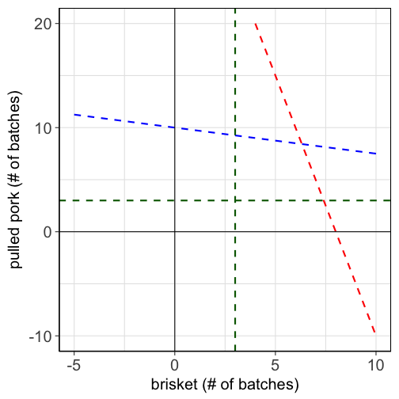
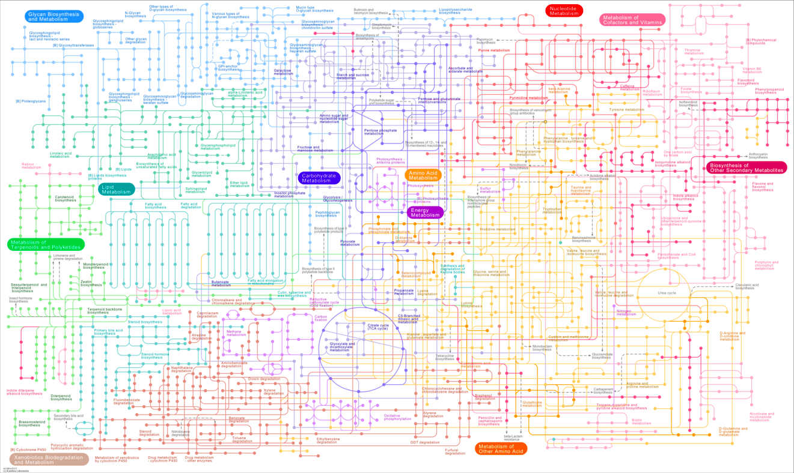
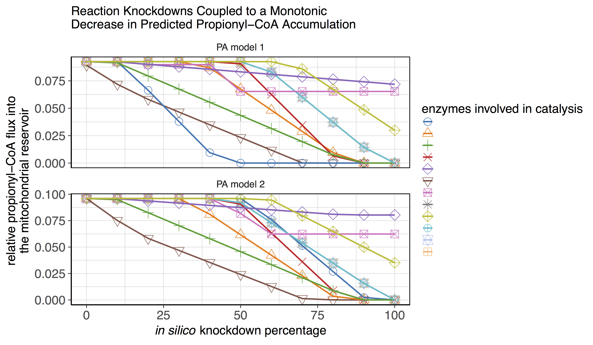

## Beauty in generality
### Many diverse problems: One solution.

> - supply chain management
> - airline scheduling
> - staffing
> - military deployment
> - waste management
> - investment planning
> - transportation engineering
> - modeling metabolism

---.dark .nobackground .quote

<q>Major problems in each field can be addressed with a technique known as __linear__ __programming__.</q>

---

## A little history

> - Linear programming is a subfield of mathematical programming (B.K.A. mathematical optimization)
> - The theory behind linear programming was worked out in the 1940s by Soviet and American mathematicians (primarily Leonid Kantorovich, George Dantzig, and John von Neumann).
> - The development was motivated by the desire to solve complex logistical military problems.
> - The words "program" / "programming" do not refer to computer programming. Rather, they refer to logistics schedules, which were referred to as "programs" by the U.S. military at the time.
> - Linear programming is now ubiquitous. Many industires with high logistical demands are wholly reliant linear programming and related techniques; e.g., airlines, delivery services, etc.

---.dark .nobackground .quote

<q>In linear programming, one searches for the __best__ way to __allocate__ resources under a set of __constraints__.</q>

---

## What does a linear program look like?

### You loved them; they're back: Word problems.

---

## What does a linear program look like?

### You loved them; they're back: Word problems.

Meremy Jauldin just founded "Humvees n' Hickories Barbecue Company" where he expects to find his fortune and true calling. He plans on starting off with an offering of pulled pork, and of course his greatest passion, brisket. The profit margins on batches of pork and brisket are \\$300 and \$500, respectively. Meremy's secret 2-step smoking process requires both hickory and apple wood. The brisket takes 15 hours in the hickory smoker and 3 hours in the apple wood smoker. The pork takes 3 hours in the hickory smoker and 12 hours in the apple wood smoker. He's got 120 smoker-hours per smoker per week. He wants to make at least 3 batches of each offering per week. How many batches of each should he make (and sell) per week to maximize his profits?

---

## What does a linear program look like?

### You loved them; they're back: Word problems.

Meremy Jauldin just founded "Humvees n' Hickories Barbecue Company" where he expects to find his fortune and true calling. He plans on starting off with an offering of pulled pork, and of course his greatest passion, brisket. The profit margins on batches of pork and brisket are \\$300 and \$500, respectively. Meremy's secret 2-step smoking process requires both hickory and apple wood. The brisket takes 15 hours in the hickory smoker and 3 hours in the apple wood smoker. The pork takes 3 hours in the hickory smoker and 12 hours in the apple wood smoker. He's got 120 smoker-hours per smoker per week. He wants to make at least 3 batches of each offering per week. How many batches of each should he make (and sell) per week to maximize his profits?


```
## Loading tidyverse: ggplot2
## Loading tidyverse: tibble
## Loading tidyverse: tidyr
## Loading tidyverse: readr
## Loading tidyverse: purrr
## Loading tidyverse: dplyr
```

```
## Conflicts with tidy packages ----------------------------------------------
```

```
## filter(): dplyr, stats
## lag():    dplyr, stats
```

<!-- html table generated in R 3.3.3 by xtable 1.8-2 package -->
<!-- Tue Jul 11 09:27:11 2017 -->
<table border=1>
<tr> <th>  </th> <th> BBQ </th> <th> apple_time </th> <th> hickory_time </th> <th> min_batch </th> <th> profit </th>  </tr>
  <tr> <td align="right"> 1 </td> <td> Pulled Pork </td> <td> 12 hrs </td> <td> 3 hrs </td> <td> 3 </td> <td> $300 </td> </tr>
  <tr> <td align="right"> 2 </td> <td> Brisket </td> <td> 3 hrs </td> <td> 15 hrs </td> <td> 3 </td> <td> $500 </td> </tr>
   </table>

---

## How can we mathematically define an LP?
The first step is to define all of the constraints.

The constraints on the hickory smoker:
$$15b+3p\leq120$$

---

## How can we mathematically define an LP?
The first step is to define all of the constraints.

The constraints on the hickory smoker:
$$15b+3p\leq120$$
The apple wood smoker:
$$3b+12p\leq120$$

---

## How can we mathematically define an LP?
The first step is to define all of the constraints.

The constraints on the hickory smoker:
$$15b+3p\leq120$$
The apple wood smoker:
$$3b+12p\leq120$$
The minimum number of batches:
$$p\geq3$$
$$b\geq3$$

---

## How can we mathematically define an LP?
Next we need to define the "objective function," which is profit in this case:
$$P=300p+500b$$

---

## How can we mathematically define an LP?

Now we have the full linear program:

constraints:
$$15b+3p\leq120$$
$$3b+12p\leq120$$
$$p\geq3$$
$$b\geq3$$
objective:
$$P=300p+500b$$

--- &twocol

## The geometric interpretation of an LP

*** =left

We can visualize the constraints on a plot:
$$15b+3p\leq120$$
<!-- $$3b+12p\leq120$$ -->

*** =right


--- &twocol

## The geometric interpretation of an LP

*** =left

We can visualize the constraints on a plot:
$$15b+3p\leq120$$
$$3b+12p\leq120$$

*** =right


--- &twocol

## The geometric interpretation of an LP

*** =left

We can visualize the constraints on a plot:
$$15b+3p\leq120$$
$$3b+12p\leq120$$
$$p\geq3$$
$$b\geq3$$

*** =right



--- &twocol

## The geometric interpretation of an LP

*** =left

We can visualize the constraints on a plot:
$$15b+3p\leq120$$
$$3b+12p\leq120$$
$$p\geq3$$
$$b\geq3$$

*** =right


--- &twocol

## A remarkable theorem

*** =left

The corner point theorem guarantees that an optimal solution will be found at one of the corner points (vertices):

1. (3, 3)
2. (6.32, 8.42)
3. (3, 9.25)
4. (7.4, 3)

*** =right


--- &twocol

## A remarkable theorem

*** =left

The corner point theorem guarantees that an optimal solution will be found at one of the corner points (vertices):

1. (3, 3)
2. (6.32, 8.42)
3. (3, 9.25)
4. (7.4, 3)

The objective function (i.e., profits) are maximized when b=6.32 and p=8.42:
$$P(b,p)=500b+300p$$
$$P(6.32,8.42)=500\times6.32+300\times8.42=5686$$

Spend your new fortune wisely, Meremy!

*** =right


---

## Moving into higher dimensions

The barbecue problem was a 2 dimensional problem with 4 inequalities (constraints). A three dimensional problem has (surprise!) a 3 dimensional solution space. The number of inequalities determines the number of facets of the polytope.


<div style='text-align: center;'>
    
</div>

---

## Moving into higher dimensions

The barbecue problem was a 2 dimensional problem with 4 inequalities (constraints). A three dimensional problem has (surprise) a 3 dimensional solution space. The number of inequalities determines the number of facets of the polytope.


<div style='text-align: center;'>
    
</div>

Many real world problems have tens of thousands of dimensions and constraints. 

If only we had some kind of automatic arithmetic doing thingy...

---

## The simplex algorithm

Even very large linear programs can be solved rapidly with computers and efficient algorithms.

<div style='text-align: center;'>
    
</div>

---

## The simplex algorithm

Even very large linear programs can be solved rapidly with computers and efficient algorithms.

<div style='text-align: center;'>
    
</div>

---

## The simplex algorithm

Even very large linear programs can be solved rapidly with computers and efficient algorithms.

<div style='text-align: center;'>
    
</div>

With improvements in computing technology and algorithmic efficiency, certain types of LPs can be solved hundreds of billions of times faster than they could just 25 years ago.

---

## How is LP used in computational biology?

### Problems in computational biology are very diverse. The applications of such a general technique is largely limited by the creativity of the user.

> - Cancer diagnosis
> - Biological sequence alignment
> - Protein folding models
> - Haplotype retrevial with missing information
> - Prediction of disease susceptibility given genotypes
> - Genome-scale prediction of metabolite utilzation (i.e., flux)

---

## Genome-scale models of metabolism

<div style='text-align: center;'>
    
</div>

---

## Genome-scale models of metabolism

<div style='text-align: center;'>
    
</div>

### For every reaction, mass in must equal mass out - debits must equal credits.

---.dark .nobackground .quote

<q>Reaction stoichiometries and the laws of thermodynamics provide system-wide constraints. Under these constraints, we want to __find the flux distribution that best matches our data__.</q>

---

## _In silico_ models of propionic acidemia

<div style='text-align: center;'>
    
</div>

Our _in silico_ models recapitulate the disease phenotype.

---

## _In silico_ target search

<div style='text-align: center;'>
    
</div>

To conduct a target search we add constraints to the model to simulate a therapeutic intervention. E.g., we can constrain the flux through a particular reaction to be zero, which simulates the effect of an inhibitor. Constraints that reduce the predicted production of P-CoA correspond to potential targets.

---

## _In silico_ target search

<div style='text-align: center;'>
    
</div>

~10 reactions out of ~4000 are predicted to affect the production of P-CoA

---

## _In silico_ target search

<div style='text-align: center;'>
    
</div>

* Apply the same strategy to new rare diseases
* Similar, but slightly different approach in NASH

--- .dark .nobackground .quote

<q> __Linear programming__ is one of many tools in the computational biologist's kit for __integrating__ experimental __data__ with existing __knowledge__ to yield __new insights__. </q>


